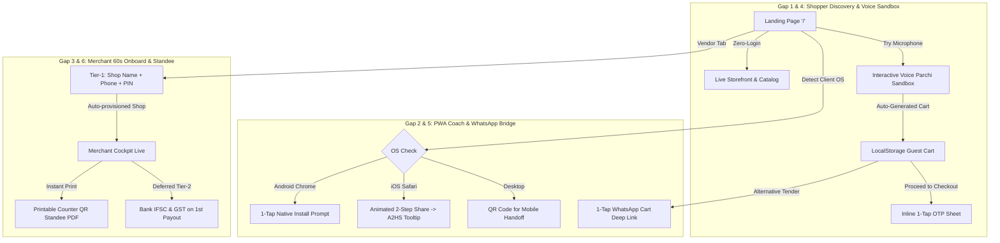

# Paaska Marketplace: Onboarding Friction Elimination & Growth Engine Plan

This plan addresses the **6 Key Overlooked Opportunities** in the Paaska onboarding flow for both **Customers** (Shoppers) and **Vendors** (Kirana store owners) in Dhanbad (PIN: 826001).

---

## Architecture & Gap Breakdown



---

## User Review Required

> [!IMPORTANT]
> **Landing Page Routing Strategy**: Currently, visiting `frontend/src/app/page.tsx` executes an immediate client-side redirect (`router.replace('/customer')`). We propose transforming `page.tsx` into the flagship Paaska Landing Page & Download Hub with a dual-audience toggle (`[ 🛒 For Shoppers ]` vs `[ 🏪 For Dukaan Owners ]`). Authenticated returning users will retain seamless 1-tap entry to their respective dashboards.

> [!TIP]
> **No Mandatory App Download Barrier**: Both the Customer Storefront and Vendor Cockpit remain 100% operational as progressive web apps in any mobile browser without forcing an app store download. The PWA installation coach is presented as a lightweight performance enhancement (2 MB, instant launch, offline catalog caching).

---

## Proposed Changes

### Component 1: Zero-Login Guest Discovery & Inline Checkout Sheet (Gap 1)

Eliminate the mandatory auth bounce (`router.push('/login')`) from the cart page. Let guest users browse, search, speak voice lists, and build carts with zero credentials.

#### [MODIFY] [frontend/src/app/customer/cart/page.tsx](file:///D:/Projects/BazaarSetu/frontend/src/app/customer/cart/page.tsx)
- Replace `<a href="/login">Login karke order karein</a>` with an inline `AuthSheet.tsx` modal trigger.
- When an unauthenticated guest clicks "Order Karein", open an inline bottom sheet that requests their phone number, auto-verifies the 4-digit OTP, merges the guest cart into the server order, and completes the transaction without navigating away.

#### [NEW] [frontend/src/components/InlineAuthSheet.tsx](file:///D:/Projects/BazaarSetu/frontend/src/components/InlineAuthSheet.tsx)
- Modern bottom sheet supporting 2-step OTP verification:
  - Step 1: 10-digit mobile number input.
  - Step 2: 4-digit OTP verification with auto-fill.
- On success: stores JWT in `localStorage`, merges `guestCart`, and triggers `handlePlaceOrder` immediately.

---

### Component 2: OS-Aware Contextual PWA Installation Coach (Gap 2)

Solve PWA ambiguity across iOS Safari and Android Chrome with device-tailored installation coaching.

#### [NEW] [frontend/src/components/PwaInstallCoach.tsx](file:///D:/Projects/BazaarSetu/frontend/src/components/PwaInstallCoach.tsx)
- Listen to `beforeinstallprompt` on Android Chrome:
  - If event captured: Renders a pulsating leaf-green button `[ 📲 Install Paaska App (2 MB) ]` with 1-tap trigger.
- Inspect `navigator.userAgent` for iOS Safari:
  - Detects if `display-mode: standalone` or `navigator.standalone` is false.
  - Renders an interactive, animated visual guide:
    1. Tap the **Share** button `[ ⎋ ]` in Safari's bottom toolbar.
    2. Scroll down and tap **"Add to Home Screen"** `[ ➕ ]`.
- Desktop view: Displays a high-contrast QR code for instant mobile handoff.

#### [NEW] [frontend/src/app/download/page.tsx](file:///D:/Projects/BazaarSetu/frontend/src/app/download/page.tsx)
- Dedicated `/download` route providing standalone PWA installation guides for both Customer and Merchant apps.

---

### Component 3: Tiered 60-Second Merchant Onboarding (Gap 3)

Remove the KYC drop-off barrier for local Kirana merchants.

#### [MODIFY] [backend/src/routes/auth.ts](file:///D:/Projects/BazaarSetu/backend/src/routes/auth.ts)
- Extend `POST /api/auth/register` to accept optional `shopName` and `pincode` for `role === 'vendor'`.
- Immediately instantiate a live `Shop` record with the merchant's chosen name (defaulting to Bank More `826001`), `deliveryRadiusKm: 3.5`, and `isActive: true`.
- Defer bank details, GST, and FSSAI to `Tier-2 KYC` (prompted in `/vendor/payouts` upon requesting payout settlement).

#### [NEW] [frontend/src/components/QuickMerchantSignup.tsx](file:///D:/Projects/BazaarSetu/frontend/src/components/QuickMerchantSignup.tsx)
- Ultra-streamlined 3-field vendor signup form:
  1. `Dukaan Name` (e.g., "Gupta Kirana Store")
  2. `Mobile Number` (10 digits)
  3. `Pincode` (Pre-filled with `826001`)
- Submits and routes directly to `/vendor/standee` with their store live in < 60 seconds.

---

### Component 4: Interactive "Voice Parchi" Hero Sandbox (Gap 4)

Let visitors test Hindi/Hinglish speech-to-cart ordering directly on the landing page before creating an account or downloading an app.

#### [NEW] [frontend/src/components/VoiceParchiSandbox.tsx](file:///D:/Projects/BazaarSetu/frontend/src/components/VoiceParchiSandbox.tsx)
- Prominent interactive microphone widget:
  - Real-time 21-bar audio visualizer in leaf-green (`#22C55E`).
  - Web Speech API integration (`webkitSpeechRecognition`) with fallback to 1-tap sample chips:
    - `[ "2 packet Amul milk aur bread" ]`
    - `[ "1kg Pyaaz aur 2kg Aalu" ]`
    - `[ "Fortune tel aur Dettol sabun" ]`
  - Instant simulated NLU parsing into structured cart chips with real prices.
  - 1-Tap CTA: `[ Transfer to Cart & Order ➔ ]` which populates `guestCart` and opens `/customer/cart`.

---

### Component 5: WhatsApp Cart Bridge (Gap 5)

Provide zero-app re-engagement and an alternative ordering tender for shoppers who prefer WhatsApp.

#### [NEW] [frontend/src/lib/whatsappBridge.ts](file:///D:/Projects/BazaarSetu/frontend/src/lib/whatsappBridge.ts)
- Helper to encode active cart items and delivery address into a formatted WhatsApp message:
  ```text
  Namaste Bighi Brothers Mart!
  Main Paaska se order mangwana chahta hoon:
  - 2x Amul Taaza Milk 500ml (₹66)
  - 1x Aashirvaad Atta 5kg (₹250)
  Total: ₹316
  Pata: Flat 301, Royal Enclave, Bank More
  Order Link: https://paaska.in/order/xyz123
  ```
- Generates `https://wa.me/91${shopPhone}?text=...` deep link.

#### [MODIFY] [frontend/src/app/customer/cart/page.tsx](file:///D:/Projects/BazaarSetu/frontend/src/app/customer/cart/page.tsx)
- Add secondary action below checkout: `[ 💬 Order via WhatsApp (Free) ]` for low-connectivity or guest users.

---

### Component 6: Instant Printable Counter QR Standee (Gap 6)

Provide every onboarded Kirana merchant with an immediate, high-trust physical artifact for their shop counter.

#### [NEW] [frontend/src/app/vendor/standee/page.tsx](file:///D:/Projects/BazaarSetu/frontend/src/app/vendor/standee/page.tsx)
- Printable high-resolution counter standee card formatted for A4 / tabletop acrylic tents:
  - Paaska leaf badge + Dukaan Name in bold display font.
  - Centered high-contrast QR code pointing to `https://paaska.in/shop/${shop.id}`.
  - 3-Step customer instructions in clear Devanagari & Hinglish:
    1. *Apne phone camera se QR scan karein*
    2. *Bolkar ya likhkar samaan chunein*
    3. *10 minute mein ghar baithe samaan payein*
  - Print optimization: CSS `@media print` rules removing headers, margins, and sidebars, outputting crisp vector graphics.

---

### Component 7: Flagship Paaska Landing Page (`/`)

Assemble all components into a high-converting storefront gateway.

#### [MODIFY] [frontend/src/app/page.tsx](file:///D:/Projects/BazaarSetu/frontend/src/app/page.tsx)
- Replace static redirect with the Paaska Flagship Landing Page.
- Structure:
  1. **Top Nav**: Paaska logo, locality pin badge (`📍 Bank More, Dhanbad · 826001`), dual audience tabs (`For Shoppers` / `For Dukaan Owners`), `[ 📲 Get App ]`.
  2. **Hero Section (Audience Toggle Aware)**:
     - *Shopper View*: Value proposition + `VoiceParchiSandbox` + direct CTA to `/customer`.
     - *Merchant View*: 0% commission guarantee + `QuickMerchantSignup` + Standee preview.
  3. **Contextual PWA Download Coach (`PwaInstallCoach`)**.
  4. **Hyperlocal Pilot Proof Section**:
     - Live store ticker: Bighi Brothers Mart (4.8 ★ · 2,242 SKUs · 10 min ETA).
     - 10-Minute Delivery Radar map graphic.
  5. **Footer**: Chiti Technologies Provenance, DPDP compliance links, Dukaan Hotline info.

---

## Documentation Deliverables

#### [NEW] [docs/PAASKA_ONBOARDING_GAP_BLUEPRINT.md](file:///D:/Projects/BazaarSetu/docs/PAASKA_ONBOARDING_GAP_BLUEPRINT.md)
- Complete technical reference document detailing the architecture, metrics, conversion funnels, and invariants for the 6 onboarding breakthrough solutions.

---

## Verification Plan

### Automated Tests
1. **TypeScript Static Typing**:
   ```powershell
   cd D:\Projects\BazaarSetu\frontend; npx tsc --noEmit
   cd D:\Projects\BazaarSetu\backend; npx tsc --noEmit
   ```
2. **Backend Regression Test Suite**:
   ```powershell
   cd D:\Projects\BazaarSetu\backend; npm test
   ```
3. **Next.js Production Build Validation**:
   ```powershell
   cd D:\Projects\BazaarSetu\frontend; npm run build
   ```

### Manual Verification
1. **Guest Browsing Flow**:
   - Open browser in incognito mode (no tokens).
   - Verify landing page loads without redirecting.
   - Use Voice Parchi Sandbox to speak/click a test item; verify item populates in guest cart.
   - Click "Order Karein"; verify `InlineAuthSheet` prompts for OTP without leaving the page.
2. **OS-Aware PWA Coach**:
   - Test on Chrome (Android mode): verify `beforeinstallprompt` button renders.
   - Test on Safari (iOS user agent): verify 2-step Share sheet tooltip renders.
3. **Merchant Onboarding & Counter Standee**:
   - Fill 3-field quick merchant form.
   - Verify new vendor shop created in `dev.db`.
   - Open `/vendor/standee` and trigger browser print preview (`Ctrl+P`); verify clean A4 acrylic layout.
