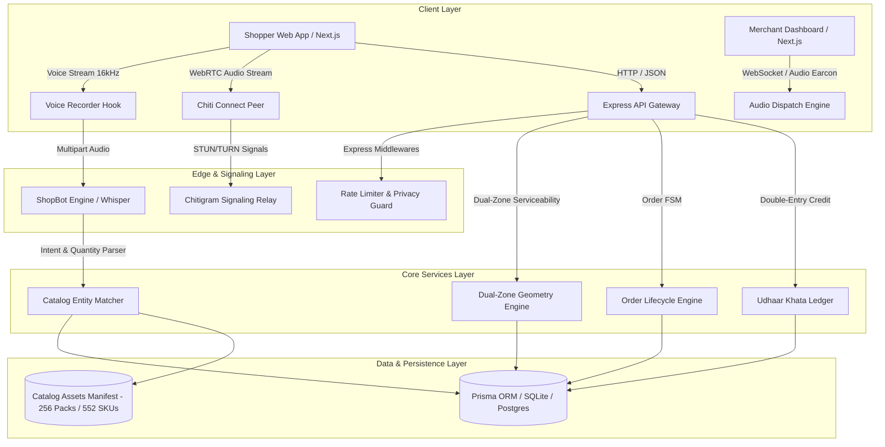
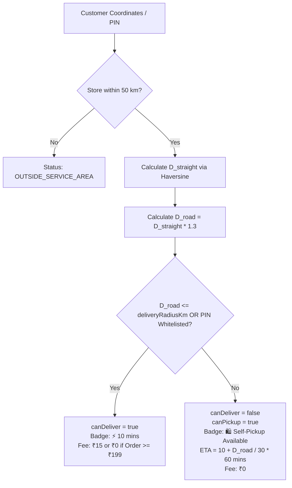

# Paaska — System Architecture Specification

**Version:** 2.0.0  
**Status:** Production Active  
**Parent Framework:** Chiti Technologies Unified Operating System  
**Last Updated:** September 6, 2026

---

## 1. High-Level System Architecture

Paaska is architected as an asynchronous, event-driven quick commerce operating system optimized for edge devices (smartphones, POS tablets) and constrained networks.



---

## 2. Component Micro-Architectures

### 2.1 Paaska Sahayak: Multilingual Voice Parchi Pipeline
The voice pipeline converts unstructured spoken shopping requests into structured, priced cart items in under 1.2 seconds.

1. **Client Audio Acquisition (`useVoiceRecorder.ts`)**:
   - Samples audio at 16,000 Hz mono via `MediaRecorder` using `audio/webm;codecs=opus` or fallback `audio/mp4`.
   - Runs an `AudioContext` `AnalyserNode` delivering a 0.0–1.0 normalized root-mean-square amplitude to render the live waveform.
   - In parallel, initializes `webkitSpeechRecognition` / `SpeechRecognition` to generate client-side interim transcript hints.

2. **Backend Entity Extraction (`shopBotEngine.ts`)**:
   - Endpoint: `POST /api/shop-bot/voice-order`.
   - Receives multipart audio blob, processes transcription, and parses colloquial quantities:
     - *"aadha kilo"* / *"half kg"* $\rightarrow$ `0.5 kg`
     - *"ek pav"* / *"250 gram"* $\rightarrow$ `250 g`
     - *"do packet"* / *"do dabba"* $\rightarrow$ `quantity: 2`
     - *"das wali"* / *"panch wali"* $\rightarrow$ price-variant match (`price: 10`)
   - Matches item names against the live catalog using Levenshtein distance and token similarity.
   - Assembles a `VoiceBasketItem[]` containing `productId`, `productName`, `price`, `unit`, and studio pack shot `image`.

3. **Interactive Review (`VoiceParchiModal.tsx`)**:
   - Renders bottom sheet with recognized items, quantities, and unmatched suggestions.
   - Supports `[+]` / `[-]` adjustments and 1-tap addition to cart or instant checkout.

### 2.2 Chiti Connect: In-App Calling Hotline
Enables zero-latency voice communication directly between customer and shopkeeper with strict identity masking.

1. **WebRTC Signaling Flow**:
   - Customer taps `[ 📞 Call Dukaan ]` on the store header or active order tracking screen.
   - `useChitiConnectCall.ts` generates an ephemeral SDP offer sent to the merchant's active socket channel.
   - If peer handshake does not complete within 4,000 ms, the system degrades automatically to a simulated masked VoIP relay.
2. **Real-time Audio Visualizer (`ChitiConnectVisualizer.tsx`)**:
   - 21 vertical frequency bars animated using Web Audio FFT analysis (`analyser.getByteFrequencyData`).
   - Uses Chiti leaf-green gradient (`#10B981` to `#059669`) with active call duration timer.
3. **Zero-Leakage Guarantee**:
   - No phone numbers are exchanged. Calls terminate with an anonymized audit entry in `POST /api/chitigram/call-record`.

### 2.3 Dual-Zone Location Intelligence & Routing Geometry
Traditional platforms reject orders outside a tight polygon. Paaska models the commercial reality of Indian tier-2/3 district hubs where customers live 10–30 km away but commute daily.



- **Haversine Formula**: Calculates great-circle distance $D_{\text{straight}}$ between customer `(lat1, lng1)` and shop `(lat2, lng2)`.
- **Road Curvature Factor ($1.3\times$)**: Empirically accounts for Dhanbad urban road geography ($D_{\text{road}} = D_{\text{straight}} \times 1.3$).
- **Driving ETA**: Assumes an average district commute speed of 30 km/h:  
  $$\text{ETA}_{\text{minutes}} = 10 + \text{Math.round}\left(\frac{D_{\text{road}}}{30} \times 60\right)$$
- **12-Hour Counter Pickup**: If customer selects pickup, address fields are bypassed, delivery fee is ₹0, and the order is issued with a 4-digit OTP valid for 12 hours.

### 2.4 Merchant Audio Dispatch Engine
Dukaan owners rarely monitor silent screens while managing counter queues. The Audio Dispatch engine (`audioDispatch.ts`) guarantees immediate acoustic awareness:

1. **Urgency Earcon (Oscillator Synthesizer)**:
   - Fires a three-note rising frequency chime: 880 Hz $\rightarrow$ 1320 Hz $\rightarrow$ 1760 Hz using a Web Audio `triangle` oscillator with exponential gain envelope.
   - Cuts through street traffic and shop chatter without sounding like a harsh telephone bell.
2. **Spoken Hinglish Dispatch**:
   - Synthesizes dynamic order announcement using `SpeechSynthesis`:
     *"Naya order! [Grahak Name] ne [X] items mangwaye hain. Total [Amount] rupaye. [Locality] ke liye."*
   - Automatically selects `hi-IN` or `en-IN` voice with fallback to natural browser default.

---

## 3. Data Model Architecture (Prisma Schema)

```prisma
model Shop {
  id                  String     @id @default(uuid())
  name                String
  slug                String     @unique
  address             String
  lat                 Float      @default(23.7957)
  lng                 Float      @default(86.4304)
  deliveryRadiusKm    Float      @default(3.5)
  serviceablePincodes String     @default("826001")
  minOrderAmount      Float      @default(0.0)
  deliveryFee         Float      @default(15.0)
  freeDeliveryAbove   Float      @default(199.0)
  products            Product[]
  orders              Order[]
  udhaarAccounts      UdhaarAccount[]
}

model Product {
  id          String   @id @default(uuid())
  name        String
  price       Float
  unit        String
  categoryId  String
  image       String?
  inStock     Boolean  @default(true)
  shopId      String
  shop        Shop     @relation(fields: [shopId], references: [id])
}

model Order {
  id                String       @id @default(uuid())
  shopId            String
  customerId        String
  items             String       // Serialized JSON OrderItem[]
  totalAmount       Float
  deliveryFee       Float
  orderType         String       @default("DELIVERY") // "DELIVERY" | "PICKUP"
  pickupOtp         String?      // 4-digit verification code
  pickupExpiresAt   DateTime?
  status            String       @default("PENDING")
  paymentMethod     String       // "COD" | "UPI" | "UDHAAR"
  deliveryAddress   String?
  customerLocation  String?      // "lat,lng"
  createdAt         DateTime     @default(now())
}
```

---

## 4. Security, Privacy & Performance Boundaries

- **VOICE_INV_007 / PAASKA_INV_002 (Privacy)**: Customer phone numbers are strictly isolated. Orders reference opaque UUIDs. Call metadata records only duration and completion status.
- **Ephemeral Audio Storage**: Audio blobs sent to `POST /api/shop-bot/voice-order` are stored in temporary RAM buffers and released immediately after transcription inference.
- **Asset Immutability**: All 256 studio pack shots are served with long-term cache headers (`Cache-Control: public, max-age=31536000, immutable`).
- **Double-Entry Ledger Invariant**: Every `UdhaarTransaction` requires an equal and opposite update to `UdhaarAccount.balance`, verified with database transaction locks.
